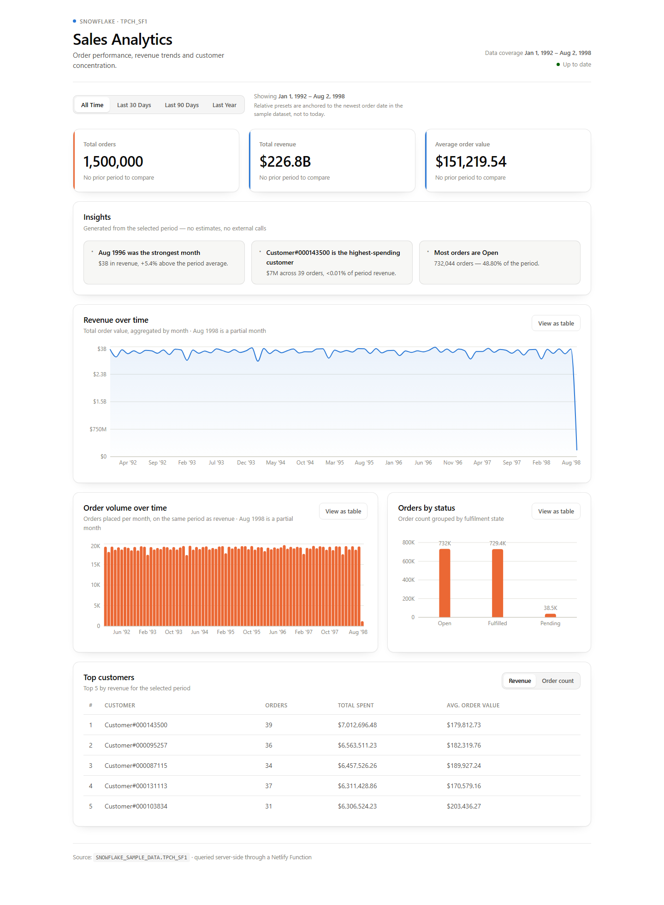

# ❄️ Snowflake Sales Analytics Dashboard

A full-stack analytics dashboard built with **React, Netlify Functions, and Snowflake**.

The application queries Snowflake's `SNOWFLAKE_SAMPLE_DATA` dataset and displays real sales analytics through an interactive React dashboard — KPIs with period-over-period deltas, monthly revenue and order trends, customer concentration, and a deterministic insights panel.



## 🚀 Live Demo

Coming soon — deployed with Netlify.

## 📊 Features

### Metrics

- Total order count, total revenue, and average order value
- Period-over-period deltas on every KPI, compared against the equal-length window immediately before the selected range
- Large currency values formatted compactly (`$226.8B`) with the exact figure on hover

### Date filtering

- Presets: **All Time**, **Last 30 Days**, **Last 90 Days**, **Last Year**
- Filtering by `O_ORDERDATE`, applied server-side to every query
- One filter row scoping the whole page — every card, chart and table re-renders against the same slice
- The resolved window is always shown, so the reader never has to guess what "last 90 days" meant

### Charts

- **Revenue over time** — monthly revenue as a line with an area wash
- **Order volume over time** — monthly order count as a column chart
- **Orders by status** — order count grouped by fulfilment state, with the TPCH single-letter codes expanded to `Open` / `Fulfilled` / `Pending`
- Every chart has a **table view** twin, so no value is reachable only by hovering

### Customer analytics

- Customer name, order count, total spent, and average order value
- Sortable between **revenue** and **order count** rankings, with no refetch

### Insights

- Deterministic observations computed from the data already on screen — no external AI API
- Which order status dominates, which month was strongest, which customer spent the most, and whether revenue and order volume rose or fell against the previous period

### UX

- Loading **skeletons** shaped like the real layout on first paint
- Refetches hold the previous render at reduced opacity — no skeleton flash, no layout jump
- A friendly error state with a **retry** button
- Responsive from ~360px up; light and dark mode

## 🏗️ Architecture

```text
React / Vite Frontend
        │
        │ fetch("/.netlify/functions/dashboard?range=90d")
        ▼
Netlify Serverless Function
        │
        │ snowflake-sdk  (credentials read from process.env)
        ▼
Snowflake
        │
        ▼
SNOWFLAKE_SAMPLE_DATA
        │
        ▼
TPCH_SF1
   ├── ORDERS
   └── CUSTOMER
```

The React frontend does **not** connect directly to Snowflake.

Instead, the frontend calls a Netlify serverless function. The function securely connects to Snowflake, executes SQL queries, and returns the results to React as JSON.

This keeps Snowflake credentials on the server side rather than exposing them in the browser.

### Layers

| Layer | Location | Responsibility |
|---|---|---|
| Query building | `netlify/functions/lib/queries.mjs` | Date-range resolution and SQL builders. Pure — no I/O, unit tested without credentials. |
| Function handler | `netlify/functions/dashboard.mjs` | Connection, concurrent execution, row → JSON mapping, caching. |
| API client | `src/lib/api.js` | The only place `fetch` is called. Turns failures into typed errors. |
| Fetch state | `src/hooks/useDashboardData.js` | Owns loading / refetching / error / retry so components stay presentational. |
| Pure logic | `src/lib/{format,insights,dateRanges,chartTheme}.js` | Formatting and deterministic insight generation. |
| Presentation | `src/components/*.jsx` | Charts, cards, tables, filters. No data fetching. |

## 📅 A note on date ranges

The TPCH sample dataset ends on **1998-08-02**. Anchoring "Last 30 Days" to `CURRENT_DATE` would return **zero rows** for every preset except All Time.

Relative presets are therefore anchored to the **newest `O_ORDERDATE` in the table**, not to today. The dashboard states this directly under the filter, and the header shows the dataset's full coverage window.

The trend charts also flag a truncated final bucket (`Aug 1998 is a partial month`) — August 1998 holds two days of orders, which would otherwise plot as a revenue collapse.

## 🔌 API

**`GET /.netlify/functions/dashboard`**

| Query param | Values | Notes |
|---|---|---|
| `range` | `all` · `30d` · `90d` · `1y` | Defaults to `all`; an unknown value falls back to `all`. |
| `from` / `to` | `YYYY-MM-DD` | Optional custom range. Clamped to the dataset; reversed inputs are reordered; malformed dates are ignored. |

Response:

```jsonc
{
  "range":       { "key": "90d", "label": "Last 90 Days", "from": "1998-05-05", "to": "1998-08-02" },
  "dataBounds":  { "min": "1992-01-01", "max": "1998-08-02" },

  "totalOrders": 56018,
  "totalRevenue": 8475675778.23,
  "averageOrderValue": 151302.72,

  // null for All Time — there is no comparable prior window
  "previousPeriod": { "from": "1998-02-04", "to": "1998-05-04", "totalOrders": 56402, /* … */ },

  "ordersByStatus": [{ "status": "O", "total": 56018 }],
  "monthlyTrend":   [{ "month": "1998-05", "orders": 16856, "revenue": 2549199824.92 }],
  "topCustomers":   [{ "name": "Customer#000116068", "orders": 5,
                       "totalSpent": 1268982.35, "averageOrderValue": 253796.47 }]
}
```

Errors return `500` with `{ "error": "Failed to load Snowflake data" }`. The underlying Snowflake error is logged server-side and never sent to the browser.

## 📈 Snowflake Analytics

The dashboard executes SQL queries against Snowflake to calculate business metrics. Every date is passed as a **bind parameter**, never interpolated into SQL.

Headline KPIs:

```sql
SELECT
    COUNT(*)                                AS TOTAL_ORDERS,
    ROUND(COALESCE(SUM(O_TOTALPRICE), 0), 2) AS TOTAL_REVENUE,
    ROUND(COALESCE(AVG(O_TOTALPRICE), 0), 2) AS AVG_ORDER_VALUE
FROM SNOWFLAKE_SAMPLE_DATA.TPCH_SF1.ORDERS
WHERE O_ORDERDATE BETWEEN :1 AND :2;
```

Monthly trend, powering both time-series charts from a single result set:

```sql
SELECT
    TO_CHAR(DATE_TRUNC('MONTH', O_ORDERDATE), 'YYYY-MM') AS MONTH,
    COUNT(*)                       AS TOTAL_ORDERS,
    ROUND(SUM(O_TOTALPRICE), 2)    AS TOTAL_REVENUE
FROM SNOWFLAKE_SAMPLE_DATA.TPCH_SF1.ORDERS
WHERE O_ORDERDATE BETWEEN :1 AND :2
GROUP BY 1
ORDER BY 1;
```

Top customers, ranked by revenue **and** order count in one pass. The dual `QUALIFY` means switching the table's sort re-ranks a genuinely complete list instead of re-sorting a revenue-biased sample — and costs no extra round trip:

```sql
SELECT
    C.C_NAME                        AS CUSTOMER_NAME,
    COUNT(*)                        AS TOTAL_ORDERS,
    ROUND(SUM(O.O_TOTALPRICE), 2)   AS TOTAL_SPENT,
    ROUND(AVG(O.O_TOTALPRICE), 2)   AS AVG_ORDER_VALUE
FROM SNOWFLAKE_SAMPLE_DATA.TPCH_SF1.ORDERS O
JOIN SNOWFLAKE_SAMPLE_DATA.TPCH_SF1.CUSTOMER C
  ON O.O_CUSTKEY = C.C_CUSTKEY
WHERE O.O_ORDERDATE BETWEEN :1 AND :2
GROUP BY C.C_NAME
QUALIFY ROW_NUMBER() OVER (ORDER BY TOTAL_SPENT DESC)  <= :3
     OR ROW_NUMBER() OVER (ORDER BY TOTAL_ORDERS DESC) <= :3
ORDER BY TOTAL_SPENT DESC;
```

## ⚡ Performance

- The function opens **one connection** and runs the five independent queries with `Promise.all` rather than sequentially.
- Dataset bounds are resolved once and cached — they never change.
- Responses are cached per warm instance for 5 minutes, keyed by the requested range. A repeat request returns in ~1ms (`X-Cache: HIT`) instead of ~3.5s.
- `Cache-Control: public, max-age=0, s-maxage=300` lets Netlify's edge serve repeats too.
- The client aborts in-flight requests when the range changes, so a slow response can't overwrite a newer one.

## 🎨 Design notes

- **No dual-axis charts.** Revenue and order volume are separate panels sharing the same x-axis, because aligning two y-scales on one plot invents a correlation that isn't in the data.
- **Colour follows the measure, not the chart.** Money is always blue, order counts always orange.
- Both palettes are validated for colour-blind separation against the app's actual light and dark surfaces (worst adjacent CVD ΔE 24.7 light / 26.8 dark, all steps ≥ 3:1 contrast).
- Direction is never carried by colour alone — deltas pair an arrow and a sign with the hue, and insights carry a tone icon.
- Tabular figures in table columns and axis ticks; proportional figures for large standalone values.

## 🛠️ Technologies

### Frontend

- React 19
- Vite 8
- JavaScript
- CSS (custom properties, light/dark tokens)
- Recharts

### Backend

- Netlify Functions
- Node.js
- Snowflake Node.js SDK

### Data

- Snowflake
- SQL
- `SNOWFLAKE_SAMPLE_DATA.TPCH_SF1`

### Tooling

- Vitest + Testing Library + jsdom
- Oxlint

### Deployment

- GitHub
- Netlify

## 🔐 Security

Snowflake credentials are stored using environment variables and are never committed to the repository.

Required environment variables:

```text
SNOWFLAKE_ACCOUNT
SNOWFLAKE_USER
SNOWFLAKE_PASSWORD
SNOWFLAKE_WAREHOUSE
SNOWFLAKE_DATABASE
SNOWFLAKE_SCHEMA
```

The local `.env` file is excluded through `.gitignore`.

Additional measures:

- Credentials are read only inside the Netlify Function — the browser bundle never contains them.
- All user-supplied dates are validated and passed as bind parameters, so a query string can't reach the SQL text.
- Snowflake error details are logged server-side; the client receives a generic message.

For deployment, set the same variables under **Site configuration → Environment variables** in Netlify.

## 💻 Running Locally

Clone the repository:

```bash
git clone <repository-url>
cd snowflake-sales-dashboard
```

Install dependencies:

```bash
npm install
```

Create a `.env` file containing your Snowflake connection configuration.

Then run the application through Netlify Dev:

```bash
npx netlify dev
```

Open:

```text
http://localhost:8888
```

> Use `netlify dev` rather than `npm run dev`. Vite alone serves the frontend on `:5173` but does not serve `/.netlify/functions/*`, so the dashboard would have no data source.

### Scripts

| Command | What it does |
|---|---|
| `npm run dev` | Vite only (no functions) |
| `npm run build` | Production build to `dist/` |
| `npm run preview` | Preview the production build |
| `npm run lint` | Oxlint |
| `npm test` | Run the test suite once |
| `npm run test:watch` | Watch mode |

## 🧪 Testing

```bash
npm test
```

85 tests across 9 files, covering:

- **Range resolution** — preset anchoring, equal-length comparison windows, clamping, reversed and malformed custom dates, unknown presets
- **Query builders** — that dates are bound rather than interpolated, and that every query filters on `O_ORDERDATE`
- **Formatting** — compact and full currency, partial-month detection, percentage change, sub-0.01% shares
- **Insights** — determinism, tone selection, and the omission of comparisons when there is no prior window
- **API client** — request shape, HTTP failures, network failures, aborts, unreadable bodies
- **Components** — metric deltas, filter presets, customer re-ranking, insight rendering
- **App integration** — the loading, success, and error states end to end, including retry recovery and the dimmed hold during a refetch

The tests mock `fetch`, so they run without Snowflake credentials.

## 📁 Project Structure

```text
snowflake-sales-dashboard/
├── docs/
│   └── dashboard.png
├── netlify/
│   └── functions/
│       ├── dashboard.mjs           # handler: connect, run queries, map to JSON
│       └── lib/
│           ├── queries.mjs         # pure date logic + SQL builders
│           └── queries.test.mjs
├── public/
├── src/
│   ├── App.jsx                     # composition only
│   ├── App.css                     # design tokens + layout
│   ├── App.test.jsx
│   ├── main.jsx
│   ├── index.css
│   ├── components/
│   │   ├── ChartCard.jsx           # shared panel shell + table-view toggle
│   │   ├── ChartTooltip.jsx
│   │   ├── DashboardHeader.jsx
│   │   ├── DateFilter.jsx
│   │   ├── EmptyChart.jsx
│   │   ├── ErrorState.jsx
│   │   ├── InsightsPanel.jsx
│   │   ├── MetricCard.jsx
│   │   ├── OrdersStatusChart.jsx
│   │   ├── OrdersTrendChart.jsx
│   │   ├── RevenueChart.jsx
│   │   ├── Skeleton.jsx
│   │   └── TopCustomersTable.jsx
│   ├── hooks/
│   │   ├── useColorScheme.js
│   │   └── useDashboardData.js
│   ├── lib/
│   │   ├── api.js                  # the only fetch call
│   │   ├── chartTheme.js
│   │   ├── dateRanges.js
│   │   ├── format.js
│   │   └── insights.js
│   └── test/
│       ├── fixtures.js
│       └── setup.js
├── .env                            # gitignored
├── .gitignore
├── netlify.toml
├── vite.config.js
├── package.json
└── README.md
```

## 🧠 What I Learned

This project gave me hands-on experience with:

- Querying cloud data with Snowflake and SQL
- Connecting Node.js to Snowflake
- Building serverless APIs with Netlify Functions
- Connecting a React frontend to an API using `fetch`
- Managing asynchronous data with `useEffect` and `useState`
- Keeping database credentials outside frontend code
- Transforming SQL results into JSON for frontend consumption
- Visualizing analytics data with React
- Debugging local development and deployment configuration
- Running independent queries concurrently instead of sequentially, and caching what never changes
- Window functions (`QUALIFY`, `ROW_NUMBER`) to answer two ranking questions in one query
- Separating pure logic from presentation so both can be tested without a database
- Deriving loading state during render instead of setting it inside an effect
- Designing charts that don't mislead — no dual axes, no colour-only encoding, and flagging partial periods
